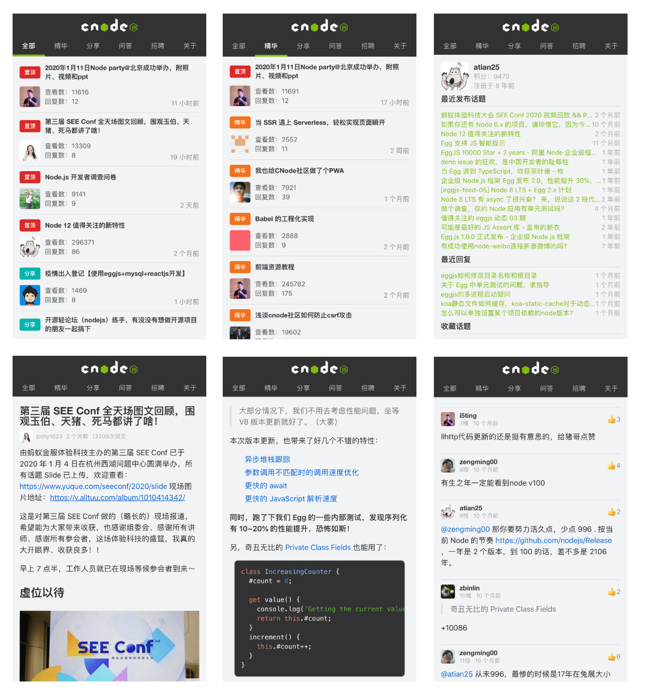

#### Cnodejs based on react

此项目为复刻[cnode社区](https://cnodejs.org)制作的H5版本，采用react hooks全面改写，零外部UI组件依赖。可供入门react hooks进行研究。预览效果，可扫描文章下方的二维码。`PS：由于cnode服务器在海外，API请求延时有时会比较长。`

#### Feature / 功能

- [x] 骨架屏Loading动画（后续考虑使用自动化生成）
- [x] 异步Hook`useAsync`
- [x] 列表页无限滚动`useLoadMore`（采用`IntersationObserver`）
- [ ] 列表页数据缓存策略
- [x] markdown与代码高亮

- [ ] 用户登录与保持
- [ ] 点赞与收藏

#### Design / 效果图

#### Preview / 预览

